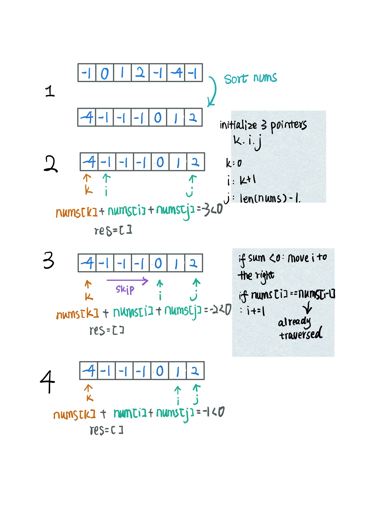
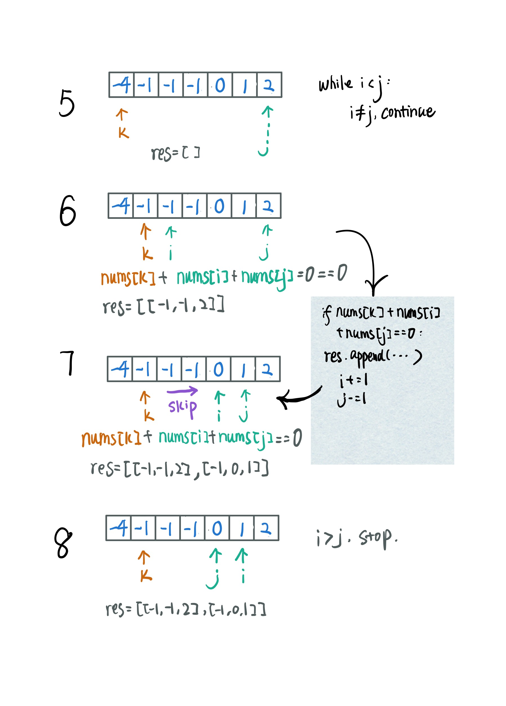
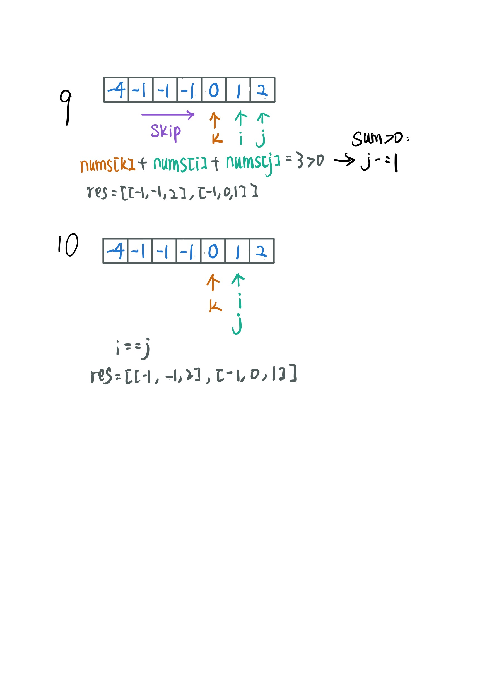

### Lc.15 3Sum   
#### My solution   
Using hashmap, I can get results but I couldn't remove duplicates   
```
class Solution:
    def threeSum(self, nums: List[int]) -> List[List[int]]:
        res = []
        count_sum = {}
        for i in range(len(nums)):
            for j in range(i+1, len(nums)):
                if i != j:
                    count_sum[0-(nums[i]+nums[j])] = [nums[i], nums[j]]
        print(count_sum)

        for key in count_sum:
            cur = count_sum[key]
            cur_sum = []
            for val in count_sum[key]:
                cur_sum.append(nums.index(val))
    
            for k in range(len(nums)):
                if k not in cur_sum and nums[k] == key:
                    cur.append(nums[k])
                    res.append(cur)
                
        return res 
```
#### Two pointers    
Sort the nums array first. Then using two pointers   
```
class Solution:
    def threeSum(self, nums: List[int]) -> List[List[int]]:
        nums.sort()
        res = []
        k = 0

        for k in range(len(nums)-2):
            if nums[k]>0:
                break
            if k>0 and nums[k] == nums[k-1]:
                continue # skip same nums[k]
            i = k+1
            j = len(nums)-1
            while i<j:
                nums_sum = nums[i] + nums[j] + nums[k]
                if nums_sum < 0:
                    i += 1
                    while i < j and nums[i] == nums[i-1]:
                        i += 1
                elif nums_sum > 0:
                    j -= 1
                    while i < j and nums[j] == nums[j+1]:
                        j -= 1
                else:
                    res.append([nums[i], nums[j], nums[k]])
                    i += 1
                    j -= 1
                    while i<j and nums[i] == nums[i-1]: i += 1
                    while i<j and nums[j] == nums[j+1]: j -= 1
        return res
```



